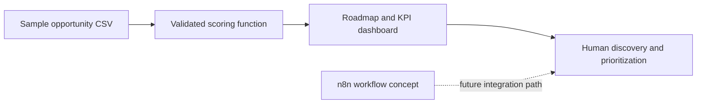

# AI Automation Command Center

Operations decision-support dashboard for collecting, scoring, and prioritizing workflow-automation opportunities.

Live demo: https://ai-automation-command-center.streamlit.app/


## What It Implements

- Streamlit roadmap and KPI dashboard
- Shared, tested priority-scoring function
- Department and roadmap-status filters
- Opportunity ranking and estimated time-saving analysis
- Idea-intake scoring form
- CSV export
- Importable n8n workflow **concept** for request-routing discussion

## Evidence Boundary

This repository implements automation-opportunity analysis and a demonstration n8n JSON workflow. It does not currently call an n8n webhook, persist approvals, or execute business-system actions.

The priority score is a transparent first-pass heuristic:

```text
impact * 2 + confidence * 1.5 + estimated monthly hours saved / 6 - effort
```

It supports consistent discovery conversations; it is not a financial-return guarantee.

## Architecture



## Run Locally

```bash
python -m pip install -r requirements.txt
streamlit run app.py
```

## Verify

```bash
python -m pip install pytest
pytest -q
python -m compileall app.py src tests
```

For executable AI-agent orchestration, tools, RAG, tracing, evaluation, and approval controls, see [AI Ops Workflow Automation Platform](https://github.com/RidhanPar/ai-ops-workflow-automation-platform).
