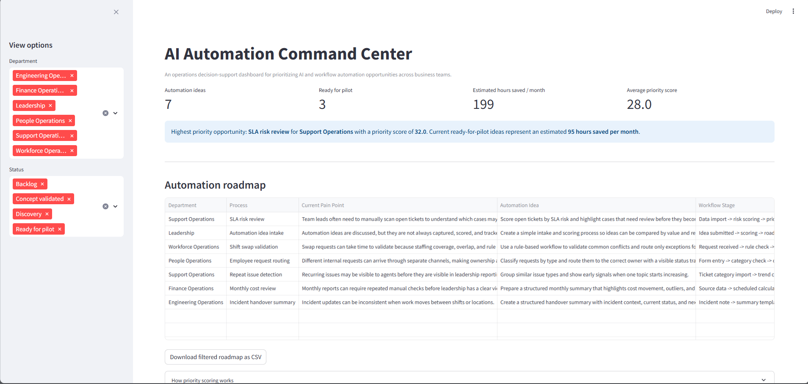
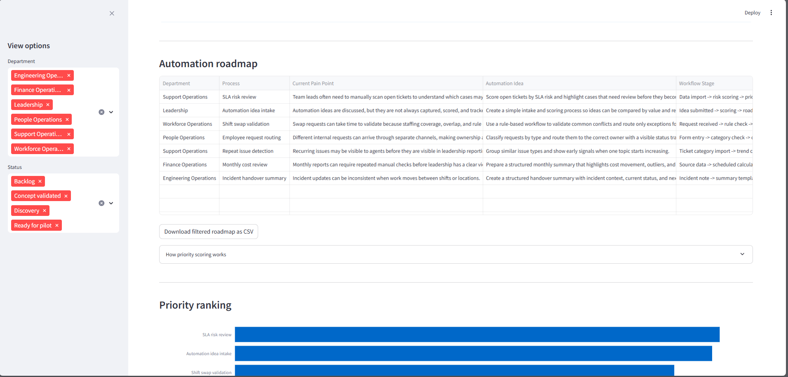
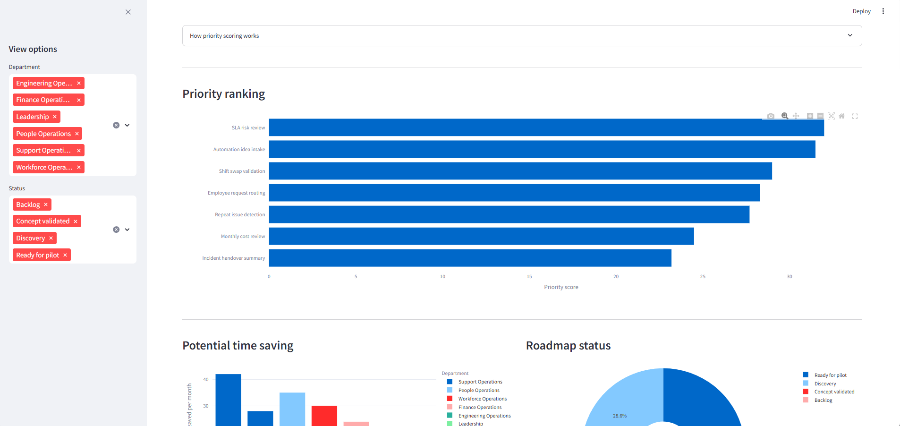
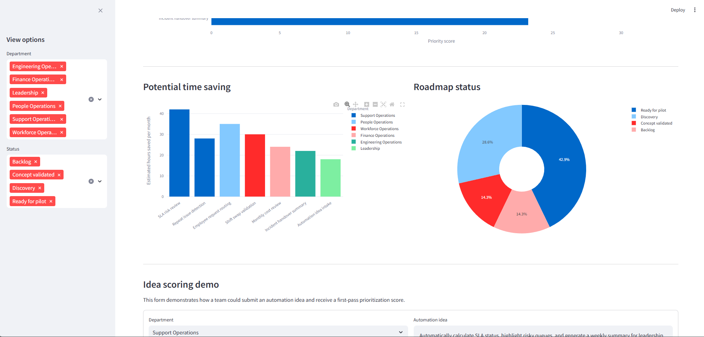
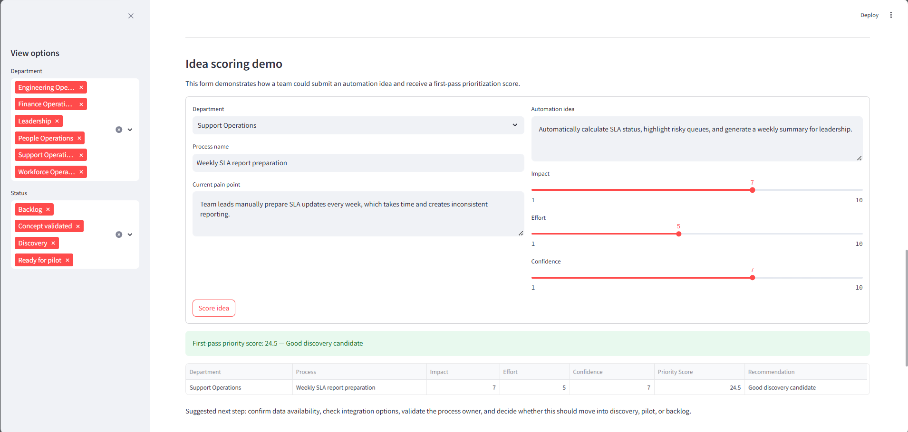

# AI Automation Command Center

Live Demo: https://ai-automation-command-center.streamlit.app/

AI Automation Command Center is an operations decision-support dashboard for identifying, prioritizing, and tracking AI and workflow automation opportunities across internal business teams.

The project is built around a common operations problem: teams often have many automation ideas, but those ideas are not always captured, compared, prioritized, or measured in a structured way. This dashboard provides a simple framework to turn scattered automation ideas into a visible roadmap.

## Business problem

In support, workforce, finance, people operations, and engineering teams, many manual tasks are repeated every week. These tasks can include checking queues, preparing SLA updates, routing requests, validating approval rules, summarizing incidents, or creating reports.

Without a structured intake and prioritization process, automation ideas can remain informal. This makes it harder for managers to decide which ideas should move into discovery, pilot, or backlog.

## Solution

This dashboard helps teams:

* collect automation ideas from different business functions
* score each idea using impact, effort, confidence, and estimated monthly time saving
* identify the highest-priority automation opportunities
* track roadmap status across discovery, backlog, concept validation, and pilot readiness
* give leadership a clear view of potential operational value
* export the filtered roadmap for reporting or review

## Screenshots

### Dashboard overview



### Automation roadmap



### Priority ranking



### Time saving and roadmap status



### Idea score result



## Key features

* Automation idea roadmap
* Impact, effort, confidence, and time-saving scoring
* Executive KPI cards
* Highest-priority opportunity summary
* Department and status filters
* CSV roadmap export
* Priority ranking chart
* Estimated monthly time-saving analysis
* Roadmap status visualization
* Idea scoring demo form
* n8n-style workflow concept for request routing

## Tech stack

* Python
* Streamlit
* Pandas
* Plotly
* CSV sample data
* n8n workflow concept

## How priority scoring works

The priority score is a first-pass decision model used to compare automation ideas before deeper discovery.

```text
priority score =
impact score × 2
+ confidence score × 1.5
+ estimated monthly hours saved / 6
- effort score
```

The goal is not to create a perfect business formula. The goal is to provide a consistent way to compare automation opportunities and support roadmap planning.

## Example use cases included

* SLA risk review
* Shift swap validation
* Employee request routing
* Monthly cost review
* Incident handover summary
* Automation idea intake
* Repeat issue detection

## Folder structure

```text
ai_automation_command_center/
├── app.py
├── requirements.txt
├── README.md
├── data/
│   └── automation_use_cases.csv
├── docs/
│   ├── architecture.md
│   ├── github_setup.md
│   └── interview_notes.md
├── n8n_workflow_demo/
│   ├── employee_request_automation_demo.json
│   └── README.md
├── portfolio_text/
│   └── portfolio_copy.md
└── assets/
    └── screenshots/
```

## How to run locally

```bash
pip install -r requirements.txt
streamlit run app.py
```

## Future improvements

* Replace CSV storage with SQLite or PostgreSQL
* Add login and role-based access
* Connect the intake form to a real database
* Add n8n webhook integration
* Add approval routing for high-priority ideas
* Add Power BI or Tableau reporting layer
* Add audit history for roadmap status changes
* Add monthly leadership summary export

## Portfolio description

AI Automation Command Center is a Streamlit-based operations dashboard for managing AI and workflow automation opportunities. It helps teams collect automation ideas, score them by business value and effort, track roadmap status, and estimate potential time-saving impact.

The project demonstrates practical skills in workflow automation planning, operational analytics, AI adoption support, dashboard development, and data-driven prioritization.
